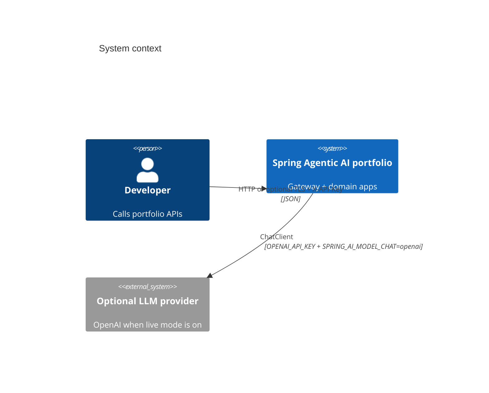
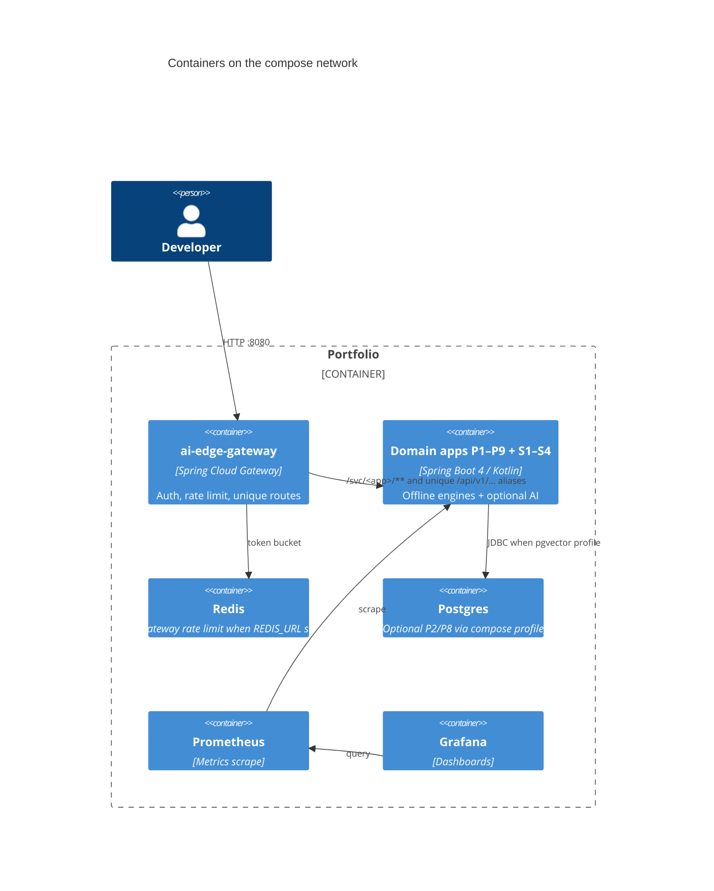

# Spring Agentic AI portfolio

[](https://github.com/mlvpatel/spring-agentic-ai-portfolio/actions/workflows/ci.yml)
[](./LICENSE)
[](./pom.xml)
[](./pom.xml)

Java 21 Maven reactor of offline-first Spring Boot / Spring AI sample services behind a Spring Cloud Gateway edge. Default paths need no paid model keys. `PortfolioAiClient` calls Spring AI `ChatClient` only when `OPENAI_API_KEY` is set and `SPRING_AI_MODEL_CHAT=openai`.

## Architecture (C4)

### Context



### Containers



## Modules

| ID | App | Port (internal) | Primary API (via gateway) |
|---|---|---|---|
| P1 | [yagni-copilot](apps/yagni-copilot/) | 8081 | `POST /api/v1/patch` |
| P2 | [design-rag-studio](apps/design-rag-studio/) | 8082 | `POST /api/v1/design-rag/ingest` · `/api/v1/design-rag/generate` |
| P3 | [quality-gate](apps/quality-gate/) | 8083 | `POST /api/v1/gate` |
| P4 | [spec-orchestrator](apps/spec-orchestrator/) | 8084 | `POST /api/v1/runs` |
| P5 | [agent-observability](apps/agent-observability/) | 8085 | trajectories + analyze |
| P6 | [mcp-broker](apps/mcp-broker/) | 8086 | tools + invoke |
| P7 | [app-factory](apps/app-factory/) | 8087 | `POST /api/v1/app-factory/generate` |
| P8 | [paper-algorithm-lab](apps/paper-algorithm-lab/) | 8088 | papers + synthesize |
| P9 | [system-architect](apps/system-architect/) | 8089 | `POST /api/v1/architect` |
| P10 | [ai-edge-gateway](apps/ai-edge-gateway/) | 8080 (host) | edge auth + routes |
| S1 | [multimodal-support-desk](apps/multimodal-support-desk/) | 8091 | `POST /api/v1/triage` |
| S2 | [kotlin-rag-microservice](apps/kotlin-rag-microservice/) | 8092 | `POST /api/v1/kotlin-rag/ingest` · `/api/v1/query` |
| S3 | [ai-validated-integration-harness](apps/ai-validated-integration-harness/) | 8093 | `POST /api/v1/validate` |
| S4 | [security-review-assistant](apps/security-review-assistant/) | 8094 | `POST /api/v1/review` |

Shared library: [libs/shared](libs/shared/). Infra: [infra/](infra/) (compose, helm, monitoring).

Bare `/api/v1/generate` and `/api/v1/ingest` are not routed (no catch-all). Use the unique aliases above or `/svc/<app>/api/v1/...`.

## Run the sandbox

```bash
./mvnw -DskipTests package
cp infra/compose/.env.example infra/compose/.env
# set GATEWAY_SECURITY_APIKEY and GRAFANA_ADMIN_PASSWORD
cd infra/compose
# Prod image build (Redis included; P2/P8 use H2 until Postgres profile is on):
docker compose -f docker-compose.yml --env-file .env up -d --build
# Fast jar-mount local loop (H2 for P2/P8):
docker compose -f docker-compose.yml -f docker-compose.dev.yml --env-file .env up -d
# Postgres for P2/P8 (pgvector JDBC):
docker compose -f docker-compose.yml -f docker-compose.prod.yml --profile prod --env-file .env up -d --build
# Optional TLS on :8443 (generate certs first):
#   ../../scripts/generate-dev-certs.sh && docker compose -f docker-compose.yml --env-file .env --profile tls up -d
```

Gateway listens on host `:8080`. Stress notes: [docs/stress-results.md](docs/stress-results.md).

## Security model

- Edge requires `X-API-Key` or `Authorization: Bearer` equal to `GATEWAY_SECURITY_APIKEY`. JWT-looking `ey*` strings and `valid-test-token` are not bypasses.
- Optional OIDC: set `OIDC_ISSUER_URI` so the gateway also accepts Bearer JWTs from that issuer. Off when blank.
- Each app also checks its own API key env var.
- Rate limit: in-process token bucket on the gateway today; prod compose sets `REDIS_URL=redis://redis:6379` for a shared limiter when wired.
- Quality gate fails sources that match a hardcoded-secret pattern.
- Design RAG and Kotlin RAG refuse empty corpora instead of inventing content.

## AI assist

`libs/shared` ships `PortfolioAiClient`. Without `OPENAI_API_KEY` (and without `SPRING_AI_MODEL_CHAT=openai`), every assist call returns a deterministic `offline-...` string. Tests assert the offline path.

## Build and test

```bash
./mvnw -B test
```

Maven tests use H2 for P2/P8. They do not require Postgres, Redis, Docker, or an OpenAI key.

## Contributing

Patches welcome. See [CONTRIBUTING.md](./CONTRIBUTING.md) for build/test (`./mvnw test`), branch/PR flow, and offline vs live AI notes. Security reports go to [SECURITY.md](./SECURITY.md), not a public issue for live secrets. Conduct: [CODE_OF_CONDUCT.md](./CODE_OF_CONDUCT.md).

## License

Apache License 2.0. See [LICENSE](./LICENSE).
