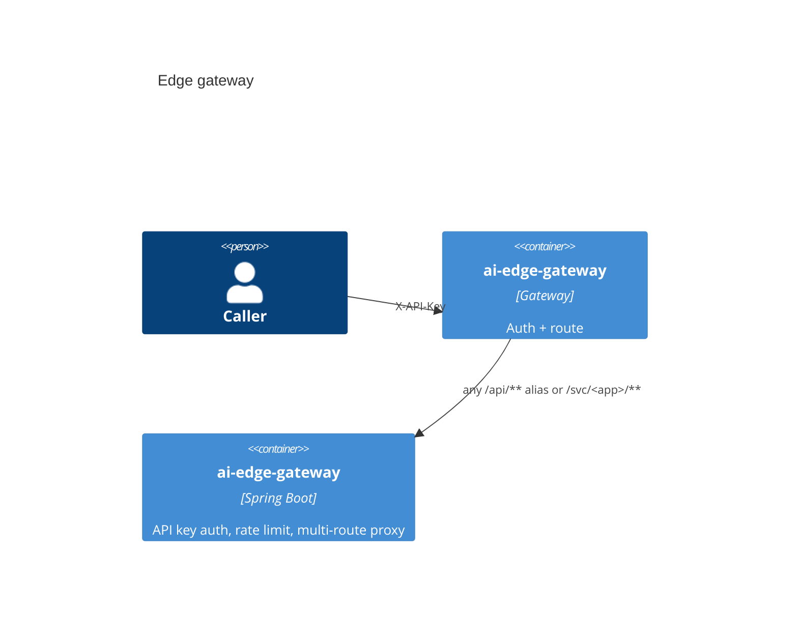

# Edge gateway

[](../../LICENSE)
[](../../pom.xml)

Catalog **P10** · internal port `8080` · API key auth, rate limit, multi-route proxy.

## Use cases

- Authenticate and forward
- Reject missing API key, `Bearer ey*`, and `Bearer valid-test-token` (expect 401)

## Container view



## Math used in code

Token bucket: capacity $B$ (burst), refill rate $r$ tokens/s. After $\Delta t$ seconds, tokens $\leftarrow \min(B,\; tokens + \lfloor \Delta t \rfloor \cdot r)$. A request consumes 1 token or returns HTTP 429.

## Run

Through the compose gateway (preferred):

```bash
# after infra/compose is up with env file keys set
curl -sS -X POST "http://localhost:8080/any /api/** alias or /svc/<app>/**" \
  -H "Content-Type: application/json" -H "X-API-Key: $GATEWAY_SECURITY_APIKEY" \
  -d '{}'
```

Standalone:

```bash
export $(grep -v '^#' apps/ai-edge-gateway/.env.example 2>/dev/null | xargs)  # or set the app API key env
./mvnw -pl apps/ai-edge-gateway -am spring-boot:run
```

## Test

```bash
./mvnw -pl apps/ai-edge-gateway -am test
```

## License

Apache-2.0. See the repository [LICENSE](../../LICENSE).
