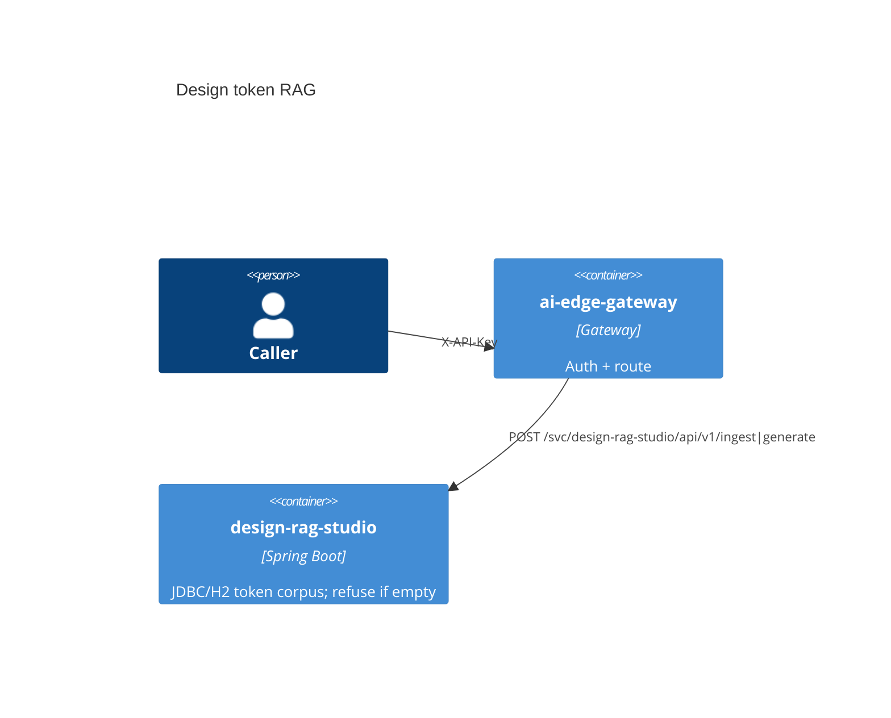

# Design token RAG

[](../../LICENSE)
[](../../pom.xml)

Catalog **P2** · internal port `8082` · JDBC/H2 token corpus; refuse if empty.

## Use cases

- Ingest CSV tokens then generate a stack snippet
- Reject missing API key, `Bearer ey*`, and `Bearer valid-test-token` (expect 401)

## Container view



## Run

Through the compose gateway (preferred):

```bash
# after infra/compose is up with env file keys set
# Primary path: POST /svc/design-rag-studio/api/v1/ingest|generate
# See PRODUCTION-SANDBOX.md for a worked example body.
```

Standalone:

```bash
export $(grep -v '^#' apps/design-rag-studio/.env.example 2>/dev/null | xargs)  # or set the app API key env
./mvnw -pl apps/design-rag-studio -am spring-boot:run
```

## Test

```bash
./mvnw -pl apps/design-rag-studio -am test
```

## License

Apache-2.0. See the repository [LICENSE](../../LICENSE).
