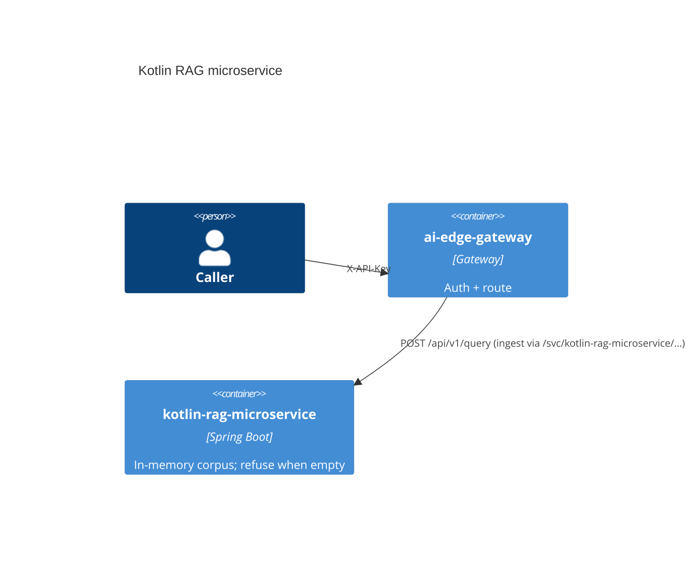

# Kotlin RAG microservice

[](../../LICENSE)
[](../../pom.xml)

Catalog **S2** · internal port `8092` · In-memory corpus; refuse when empty.

## Use cases

- Query ingested docs
- Reject missing API key, `Bearer ey*`, and `Bearer valid-test-token` (expect 401)

## Container view



## Run

Through the compose gateway (preferred):

```bash
# after infra/compose is up with env file keys set
curl -sS -X POST "http://localhost:8080//api/v1/query (ingest via /svc/kotlin-rag-microservice/...)" \
  -H "Content-Type: application/json" -H "X-API-Key: $GATEWAY_SECURITY_APIKEY" \
  -d '{}'
```

Standalone:

```bash
export $(grep -v '^#' apps/kotlin-rag-microservice/.env.example 2>/dev/null | xargs)  # or set the app API key env
./mvnw -pl apps/kotlin-rag-microservice -am spring-boot:run
```

## Test

```bash
./mvnw -pl apps/kotlin-rag-microservice -am test
```

## License

Apache-2.0. See the repository [LICENSE](../../LICENSE).
