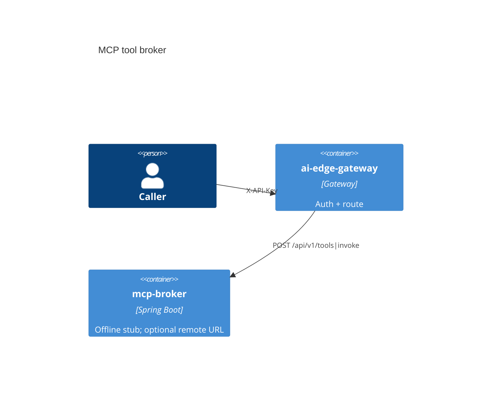

# MCP tool broker

[](../../LICENSE)
[](../../pom.xml)

Catalog **P6** · internal port `8086` · Offline stub; optional remote URL.

## Use cases

- Register and invoke a tool
- Reject missing API key, `Bearer ey*`, and `Bearer valid-test-token` (expect 401)

## Container view



## Run

Through the compose gateway (preferred):

```bash
# after infra/compose is up with env file keys set
# Primary path: POST /api/v1/tools|invoke
# See PRODUCTION-SANDBOX.md for a worked example body.
```

Standalone:

```bash
export $(grep -v '^#' apps/mcp-broker/.env.example 2>/dev/null | xargs)  # or set the app API key env
./mvnw -pl apps/mcp-broker -am spring-boot:run
```

## Test

```bash
./mvnw -pl apps/mcp-broker -am test
```

## License

Apache-2.0. See the repository [LICENSE](../../LICENSE).
