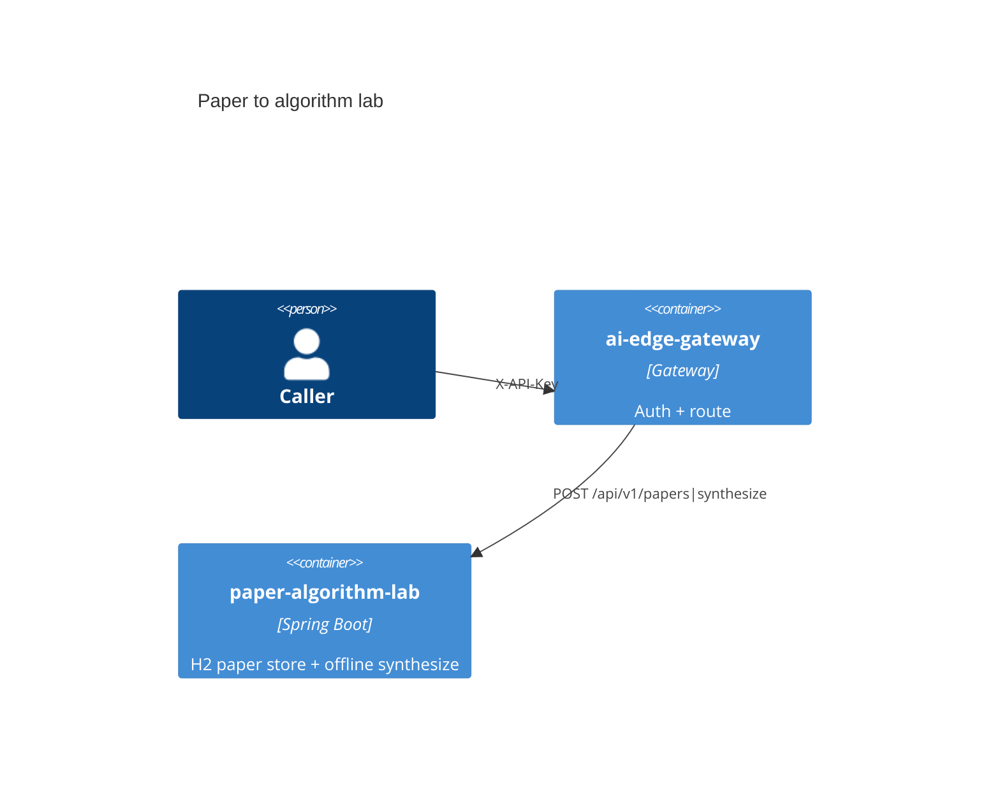

# Paper to algorithm lab

[](../../LICENSE)
[](../../pom.xml)

Catalog **P8** · internal port `8088` · H2 paper store + offline synthesize.

## Use cases

- Ingest a paper then synthesize a topic
- Reject missing API key, `Bearer ey*`, and `Bearer valid-test-token` (expect 401)

## Container view



## Run

Through the compose gateway (preferred):

```bash
# after infra/compose is up with env file keys set
# Primary path: POST /api/v1/papers|synthesize
# See PRODUCTION-SANDBOX.md for a worked example body.
```

Standalone:

```bash
export $(grep -v '^#' apps/paper-algorithm-lab/.env.example 2>/dev/null | xargs)  # or set the app API key env
./mvnw -pl apps/paper-algorithm-lab -am spring-boot:run
```

## Test

```bash
./mvnw -pl apps/paper-algorithm-lab -am test
```

## License

Apache-2.0. See the repository [LICENSE](../../LICENSE).
