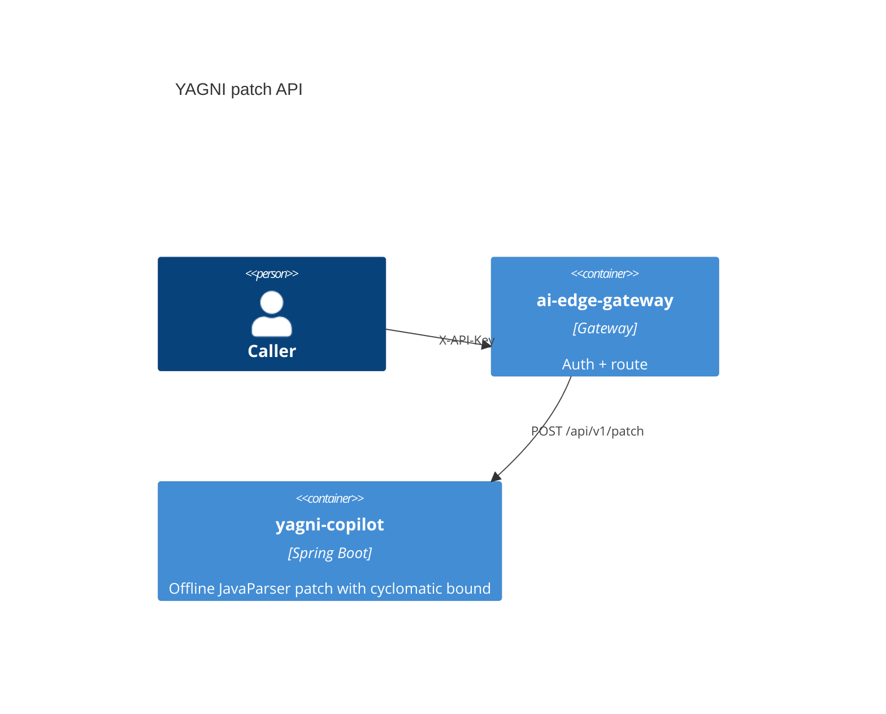

# YAGNI patch API

[](../../LICENSE)
[](../../pom.xml)

Catalog **P1** · internal port `8081` · Offline JavaParser patch with cyclomatic bound.

## Use cases

- Propose a minimal patch and report V(G)
- Reject missing API key, `Bearer ey*`, and `Bearer valid-test-token` (expect 401)

## Container view



## Math used in code

Cyclomatic complexity is counted as $V(G) = D + 1$ where $D$ is the number of decision nodes (if/for/while/catch/ternary/switch entries) in the JavaParser AST. A change is within bounds when $V(G) \le V_{\max}$ (default 5).

## Run

Through the compose gateway (preferred):

```bash
# after infra/compose is up with env file keys set
curl -sS -X POST "http://localhost:8080//api/v1/patch" \
  -H "Content-Type: application/json" -H "X-API-Key: $GATEWAY_SECURITY_APIKEY" \
  -d '{}'
```

Standalone:

```bash
export $(grep -v '^#' apps/yagni-copilot/.env.example 2>/dev/null | xargs)  # or set the app API key env
./mvnw -pl apps/yagni-copilot -am spring-boot:run
```

## Test

```bash
./mvnw -pl apps/yagni-copilot -am test
```

## License

Apache-2.0. See the repository [LICENSE](../../LICENSE).
